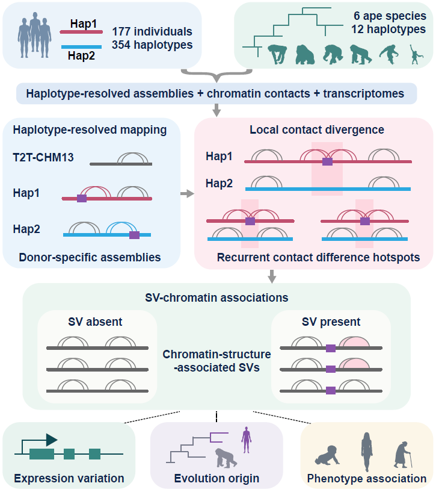

# Structural variants from donor-specific assemblies affect recurrent chromatin contact divergence in humans

This repository contains custom computational code used in the study:

**Structural variants from donor-specific assemblies affect recurrent chromatin contact divergence in humans**

Lingbin Ni, Jiadong Lin, DongAhn Yoo, Taralynn Mack, Isaac Wong, Julie Wertz, Katherine M. Munson, Kendra Hoekzema, Human Pangenome Reference Consortium (HPRC), Xinghua Shi, Jian Ma, William S. Noble, Evan E. Eichler

> **Manuscript status:** under review
> **Repository:** `pangenome_chromatin_associated_SVs`

---


---

## Overview

Understanding how genetic variation contributes to differences in three-dimensional (3D) genome organization among humans has remained challenging, in part because chromatin interaction studies typically map genetically diverse individuals to a single reference genome. This framework can obscure haplotype-specific genome structure and make it difficult to distinguish technical effects of reference representation from genuine biological variation.

Here, we integrate haplotype-resolved donor-specific assemblies (DSAs) from the Human Pangenome Reference Consortium (HPRC) with population-scale chromatin conformation data from 177 individuals representing 354 human haplotypes to directly examine the genetic basis of interindividual 3D genome variation. Our study reveals that reference choice substantially alters the inferred genomic separation of chromatin contacts even when contact identities are preserved, demonstrating a systematic limitation/bias of conventional reference-based analyses.

Using DSAs, we identifies recurrent contact difference hotspot (CDH) of haplotype-specific chromatin contact divergence across the human population and connects these regions to structural genetic variation. We identify chromatin-structure-associated structural variant (CSA-SV) associated with recurrent chromatin divergence and show that these variants are preferentially located near features of chromatin organization, including chromatin domain boundaries and loop anchors. Importantly, their effects extend beyond chromatin architecture: CSA-SVs are associated with genotype-dependent changes in gene expression, linking inherited structural variation to coordinated differences in genome organization and transcription, and show evolutionary features. These findings suggest that SVs represent an important source of both contemporary human regulatory diversity and evolutionary remodeling of genome organization.

This is a collection of analysis scripts, rather than a single automated workflow. Intermediate-data preparation and final multi-panel figure assembly may be required.

---

## Repository structure

Scripts are stored directly in the following analysis directories.

| Directory | Scripts | Purpose |
| --- | --- | --- |
| `hic_processing/` | [map_hic_to_t2t_chm13.sh](hic_processing/map_hic_to_t2t_chm13.sh), [map_hic_to_dsa_hap1.sh](hic_processing/map_hic_to_dsa_hap1.sh), [map_hic_to_dsa_hap2.sh](hic_processing/map_hic_to_dsa_hap2.sh) | Map human chromatin contact reads to CHM13 and donor-specific haplotypes. |
| `contact_matrix/` | [build_contact_matrices_t2t_chm13.sh](contact_matrix/build_contact_matrices_t2t_chm13.sh), [build_contact_matrices_dsa_hap1.sh](contact_matrix/build_contact_matrices_dsa_hap1.sh), [build_contact_matrices_dsa_hap2.sh](contact_matrix/build_contact_matrices_dsa_hap2.sh) | Build contact matrices from mapped pairs. |
| `chromatin_structure/` | [call_tads_hicexplorer.sh](chromatin_structure/call_tads_hicexplorer.sh), [call_loops_hicexplorer.sh](chromatin_structure/call_loops_hicexplorer.sh) | Call TADs, boundaries and chromatin loops. |
| `mapping_difference_analysis/` | [compare_mapping_chm13_dsa_hap1.sh](mapping_difference_analysis/compare_mapping_chm13_dsa_hap1.sh), [compare_mapping_chm13_dsa_hap2.sh](mapping_difference_analysis/compare_mapping_chm13_dsa_hap2.sh) | Compare retained read-pair IDs and contact distances between mapping targets. |
| `mapping_shift_analysis/` | [summarize_mapping_distance_differences_hap1.sh](mapping_shift_analysis/summarize_mapping_distance_differences_hap1.sh), [summarize_mapping_distance_differences_hap2.sh](mapping_shift_analysis/summarize_mapping_distance_differences_hap2.sh) | Summarize counts of contact-distance differences above specified thresholds. |
| `mapping_structure_analysis/` | [compare_loops_liftover.py](mapping_structure_analysis/compare_loops_liftover.py) | Compare loop anchors between different assemblies. |
| `contact_difference_hotspot_contact/` | [extract_haplotype_specific_pairs.sh](contact_difference_hotspot_contact/extract_haplotype_specific_pairs.sh), [remap_haplotype_specific_reads.sh](contact_difference_hotspot_contact/remap_haplotype_specific_reads.sh), [build_haplotype_mappability_tracks.sh](contact_difference_hotspot_contact/build_haplotype_mappability_tracks.sh) | Extract contacts from prepared read-ID lists, remap selected reads and build mappability tracks. |
| `contact_difference_hotspot_identification/` | [count_long_range_cis_contacts.pl](contact_difference_hotspot_identification/count_long_range_cis_contacts.pl), [call_contact_difference_hotspots.R](contact_difference_hotspot_identification/call_contact_difference_hotspots.R) | Count long-range contacts and identify CDH windows and merged regions. |
| `contact_difference_hotspot_analysis/` | [test_cdh_structure_enrichment.R](contact_difference_hotspot_analysis/test_cdh_structure_enrichment.R), [test_cdh_sv_enrichment.R](contact_difference_hotspot_analysis/test_cdh_sv_enrichment.R), [calculate_sv_in_cdh_fraction.R](contact_difference_hotspot_analysis/calculate_sv_in_cdh_fraction.R) | Evaluate CDH overlap with chromatin features and SVs, and calculate the fraction of SVs overlapping CDHs. |
| `structure_associated_SV_panCDH/` | [analyze_cdh_recurrence.R](structure_associated_SV_panCDH/analyze_cdh_recurrence.R) | Identify recurrent CDH cores from projected intervals and evaluate recurrence by permutations. |
| `structure_associated_SV_identification/` | [identify_csa_svs_by_local_overlap.R](structure_associated_SV_identification/identify_csa_svs_by_local_overlap.R) | Test associations between effective SV carrier status and local CDH occurrence. |
| `structure_associated_SV_feature/` | [analyze_csa_sv_structure_proximity.R](structure_associated_SV_feature/analyze_csa_sv_structure_proximity.R) | Compare proximity to TAD boundaries and loop anchors for CSA-SVs and other CDH-overlapping SVs. |
| `expression_analysis_mapping/` | [quantify_long_read_rna_isoquant.sh](expression_analysis_mapping/quantify_long_read_rna_isoquant.sh) | Quantify genes and transcripts from aligned long-read RNA-seq BAM files. |
| `expression_analysis_pattern/` | [test_csa_sv_expression_associations.R](expression_analysis_pattern/test_csa_sv_expression_associations.R) | Test genotype–expression associations and dosage trends. |
| `expression_analysis_integration/` | [aggregate_contact_matrices_by_sv_genotype.py](expression_analysis_integration/aggregate_contact_matrices_by_sv_genotype.py), [aggregate_insulation_by_sv_genotype.R](expression_analysis_integration/aggregate_insulation_by_sv_genotype.R) | Plot genotype-group contact matrices, pairwise matrix ratios and mean insulation profiles. |
| `expression_analysis_correlation/` | [plot_insulation_expression_correlations.R](expression_analysis_correlation/plot_insulation_expression_correlations.R) | Plot individual-level insulation–expression correlations on raw TPM and log2(TPM + 1) scales. |
| `evolution_analysis_mapping/` | [map_nhp_hic_to_chm13.sh](evolution_analysis_mapping/map_nhp_hic_to_chm13.sh), [map_nhp_hic_to_hap1.sh](evolution_analysis_mapping/map_nhp_hic_to_hap1.sh), [map_nhp_hic_to_hap2.sh](evolution_analysis_mapping/map_nhp_hic_to_hap2.sh) | Map nonhuman-primate Hi-C data. |
| `evolution_analysis_feature/` | [compare_csa_sv_sizes_by_origin.R](evolution_analysis_feature/compare_csa_sv_sizes_by_origin.R) | Compare SV sizes using supplied ancestral/derived classifications. |

---

## Analysis workflow

1. Prepare reference assemblies, indexes, chromosome-size files and sequencing inputs; map the same human source reads to CHM13, Hap1 and Hap2.
2. Build contact matrices and call TAD boundaries and loops. Compare retained contacts and loop calls between mapping targets.
3. Prepare filtered haplotype-specific read-ID lists, extract their contact pairs, and generate matching specific and total contact counts.
4. Call CDHs separately for each sample and haplotype, then evaluate overlap with SVs and chromatin features.
5. Supply CDHs projected into CHM13 coordinates for recurrence and local SV–CDH association analyses.
6. Combine CSA-SV genotypes with gene-expression tables, population-scale contact matrices and insulation tracks for expression associations and locus-level plots.
7. Use nonhuman-primate mappings and prepared origin classifications for the available evolutionary analyses.

The input preparation required at each stage is documented in the corresponding script header. For example, contact extraction uses existing filtered read-ID lists, IsoQuant quantification starts from aligned BAMs, and recurrence analysis starts from projected CDH intervals.

---

## Usage

Clone the repository:

```bash
git clone https://github.com/LingbinNi/pangenome_chromatin_associated_SVs.git
cd pangenome_chromatin_associated_SVs
```

Before running a script:

1. Read its input formats, filename patterns and coordinate conventions.
2. Replace `/path/to/...` entries and edit the settings near the beginning of the script. Most scripts use these in-file settings; scripts with command-line arguments document them explicitly.
3. Check sample names, reference assemblies, chromosome labels and required preprocessing. Use paths without whitespace where required by the shell scripts.
4. Prepare a separate output directory and follow the script's working-directory requirements. Some scripts require pre-existing reference subdirectories; others require a new output location.
5. Confirm that all upstream files and submitted jobs are complete before starting dependent analyses.

For example, after setting `cdhroot`, `svroot` and `outdir` in the SV-fraction script:

```bash
repo_dir="/path/to/pangenome_chromatin_associated_SVs"
mkdir /path/to/sv_cdh_fraction_results
cd /path/to/sv_cdh_fraction_results
Rscript "$repo_dir/contact_difference_hotspot_analysis/calculate_sv_in_cdh_fraction.R"
```

After editing the paths and settings in the matrix-aggregation script, run it from its chosen output directory:

```bash
python /path/to/pangenome_chromatin_associated_SVs/expression_analysis_integration/aggregate_contact_matrices_by_sv_genotype.py
```

The contact-counting script accepts two positional arguments:

```bash
perl /path/to/pangenome_chromatin_associated_SVs/contact_difference_hotspot_identification/count_long_range_cis_contacts.pl \
    /path/to/contact_pixels.tsv \
    /path/to/output_prefix
```

Its input is a headerless, seven-column `cooler dump --join` table containing raw integer contact counts. The parent directory for the output prefix must already exist.

Keep analysis outputs outside the code checkout. Several scripts use the current directory for output, and rerunning them can overwrite files with the same names.

---

## Citation

If you use code or methods from this repository, please cite:

> Ni L. *et al.* **Structural variants from donor-specific assemblies affect recurrent chromatin contact divergence in humans.**
> Journal information and DOI will be added upon publication.

---

## Contact

For questions regarding the code or analyses, please open a GitHub issue or contact:

**Lingbin Ni**

University of Washington, Eichler Laboratory

---

## Disclaimer

This repository contains research code developed for the analyses described in the accompanying manuscript. It is provided to support transparency and reproducibility of those analyses.
